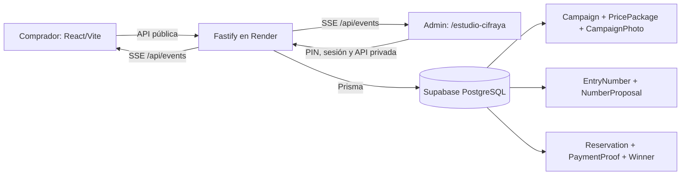
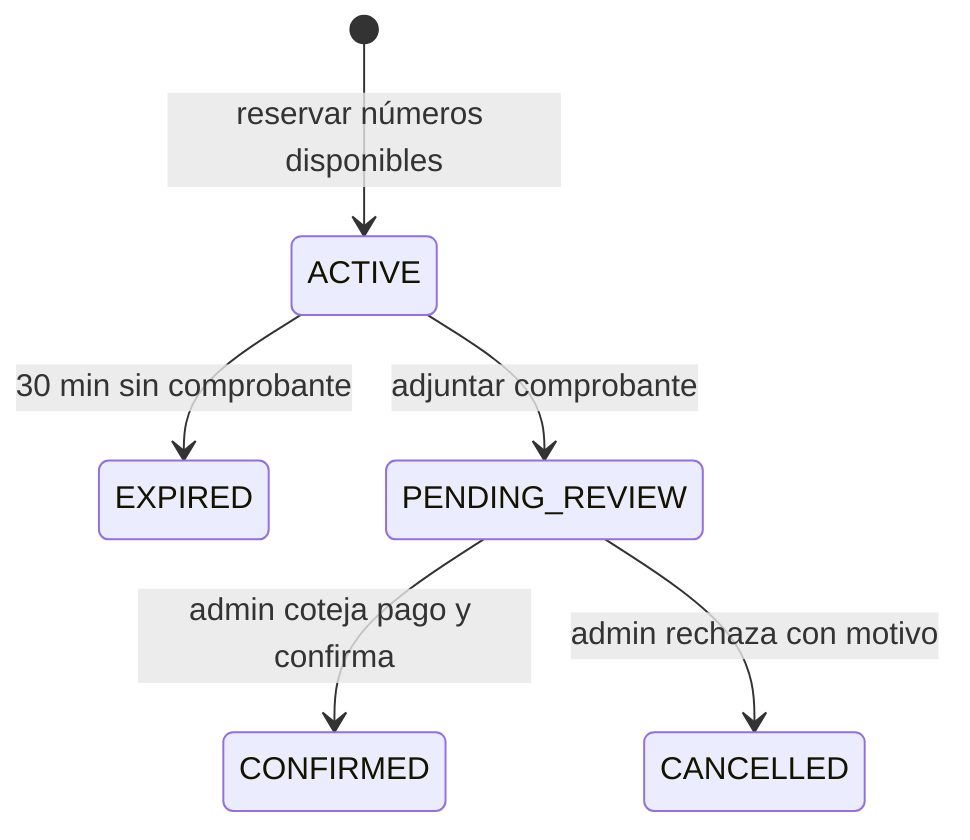

# Cifraya — mapa compacto del proyecto

Leer este archivo primero en futuras sesiones. Para una relación concreta entre archivos o funciones, consultar [`graphify-out/graph.json`](../graphify-out/graph.json) o ejecutar `graphify query "pregunta" --budget 800`. El [grafo interactivo](../graphify-out/graph.html) permite explorar visualmente el código. El grafo automático cubre código; este mapa añade reglas de negocio y decisiones.

## Rutas y archivos

| Nodo | Responsabilidad | Fuente |
|---|---|---|
| Web pública | Inicio `/`, `/buscar-boletos`, `/ganadores`, `/rifa/:slug`; selección, reserva y comprobantes | `apps/web/src/App.tsx` |
| Centro de control | `/estudio-cifraya`; rifas, boletos tipo tarjeta, ganador e historial | `apps/web/src/App.tsx`, `AdminRaffleDetail.tsx` |
| Participantes y pagos | Ficha privada por correo; revisión manual de comprobantes | `AdminParticipantDetail.tsx`, `AdminReservationReview.tsx` |
| API | Validación, autenticación, reservas atómicas, SSE y vencimientos | `apps/api/src/server.ts` |
| Datos | Modelos e índices; migraciones aplicadas al arrancar Render | `prisma/schema.prisma`, `prisma/migrations/` |
| Despliegue | Una web/API Node en Render; PostgreSQL externo en Supabase | `render.yaml` |

## Flujo de boletos

- Rifas admiten **100, 1.000 o 10.000 números** (`00–99`, `000–999`, `0000–9999`). Menos de 200: selección manual. Desde 200: propuesta aleatoria del servidor y máximo cinco cambios por selección. Los paquetes ajustan el precio automáticamente.
- La propuesta aleatoria no aparta números. La reserva sí los reclama en transacción serializable; un conflicto debe devolver 409. Un comprobante presentado a tiempo conserva el apartado durante la revisión. Solo `CONFIRMED` puede resultar ganador.
- Fotos del premio: hasta cinco; comprobantes: hasta tres. Cada imagen guardada pesa como máximo 2 MB. **Ambos tipos se guardan hoy en PostgreSQL**, no en Supabase Storage. El administrador debe cotejar SINPE con el dinero realmente recibido; la foto sola no verifica el pago.
- La ficha mini CRM relaciona reservas por correo electrónico sin distinguir mayúsculas, con historial paginado. Es una agrupación práctica, no una identidad verificada.
- Los cambios se propagan por SSE y las vistas activas consultan de respaldo cada 20 segundos. El servicio gratuito de Render puede dormir; SSE no equivale a disponibilidad garantizada 24/7.
- El PIN admin crea una sesión HMAC de ocho horas firmada con `ADMIN_TOKEN` (`apps/api/src/adminSession.ts`); sobrevive reinicios del proceso. Si vence, el formulario de borrador permanece en estado de la pestaña mientras se vuelve a ingresar el PIN.

## Reglas de trabajo

- Mantener el diseño blanco y negro y las preguntas dentro de la interfaz. Evitar texto de “prueba” en el producto público.
- No publicar credenciales, PIN, comprobantes ni datos personales en este grafo. Las rutas admin requieren sesión; los comprobantes solo se sirven con autorización.
- Verificar con `pnpm db:generate`, `pnpm build` y `git diff --check` cuando cambien esquema o código. Para actualizar el grafo automático tras cambios de código: `graphify extract . --code-only` y `graphify cluster-only . --no-label`.
