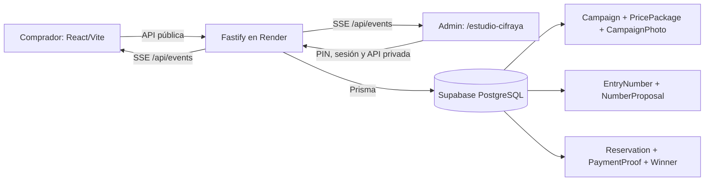
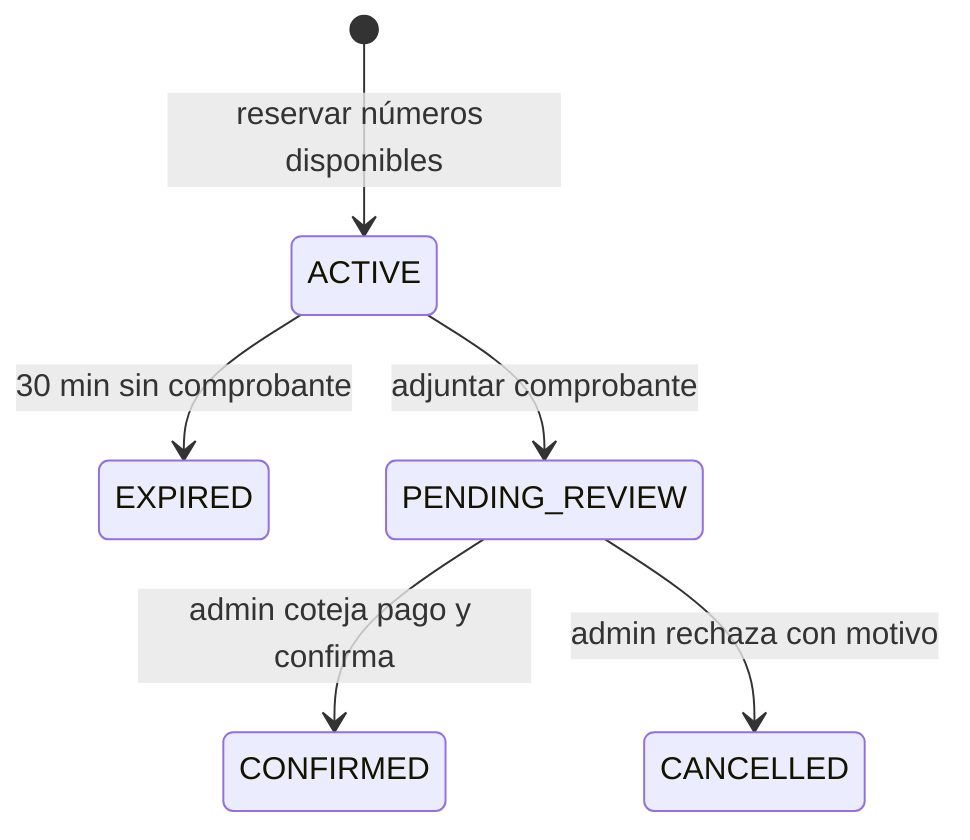

# Cifraya — mapa compacto del proyecto

Leer este archivo primero en futuras sesiones. Para una relación concreta entre archivos o funciones, consultar [`graphify-out/graph.json`](../graphify-out/graph.json) o ejecutar `graphify query "pregunta" --budget 800`. El [grafo interactivo](../graphify-out/graph.html) permite explorar visualmente el código. El grafo automático cubre código; este mapa añade reglas de negocio y decisiones.

## Rutas y archivos

| Nodo | Responsabilidad | Fuente |
|---|---|---|
| Web pública | Inicio `/`, `/buscar-boletos`, `/ganadores`, `/rifa/:slug`; selección, reserva, comprobantes, podio y footer social | `apps/web/src/App.tsx`, `apps/web/src/WinnersPodium.tsx`, `apps/web/src/FooterSocials.tsx` |
| Centro de control | `/estudio-cifraya`; creación y edición de rifas, boletos tipo tarjeta, ganador e historial | `apps/web/src/App.tsx`, `EditRaffle.tsx`, `AdminRaffleDetail.tsx` |
| Participantes y pagos | Ficha privada por correo; revisión manual de comprobantes | `AdminParticipantDetail.tsx`, `AdminReservationReview.tsx` |
| API | Rutas, validación, autenticación, reservas atómicas y SSE | `apps/api/src/server.ts` |
| Vencimientos | Liberación transaccional de apartados y coordinación de consultas simultáneas | `apps/api/src/reservationExpiry.ts` |
| Seguridad HTTP | Cabeceras CSP, bloqueo de marcos y caché privada | `apps/api/src/security.ts` |
| Búsqueda privada de boletos | Prefijos según el ancho del número y coincidencias por comprador | `apps/api/src/ticketSearch.ts`, `apps/web/src/AdminRaffleDetail.tsx` |
| Números invertidos | Inversión con ancho fijo, selección de pares disponibles y rechazo de duplicados | `apps/api/src/invertedNumbers.ts` |
| Datos | Modelos e índices; migraciones aplicadas al arrancar Render | `prisma/schema.prisma`, `prisma/migrations/` |
| Despliegue | Una web/API Node en Render; PostgreSQL externo en Supabase | `render.yaml` |

## Flujo de boletos

- Rifas admiten **100, 1.000 o 10.000 números** (`00–99`, `000–999`, `0000–9999`). La compra se hace escogiendo un paquete; el servidor asigna esa cantidad de números disponibles al azar y permite cinco regeneraciones del conjunto completo. El precio de la reserva es el precio exacto del paquete. Sin paquetes configurados, se ofrece un boleto individual como compatibilidad.
- El administrador puede habilitar invertidos en un borrador para ofrecer un paquete adicional. Se invierte el número con su ancho fijo: `1200 → 0021`. Si el comprador agrega los invertidos, recibe exactamente un número inverso distinto por cada número base y paga **dos veces** el precio del paquete. Se ofrecen solo si todos están disponibles y no se repiten ni coinciden con números base. El servidor vuelve a validarlos y reclama el conjunto completo de forma atómica al reservar. `Reservation.baseValues` distingue los números originales de los invertidos; la forma de compra no determina qué premio gana un número: los premios inversos se configuran por posición. Configuración inmutable tras publicar.
- El progreso público usa exclusivamente números con estado `SOLD` dividido entre la cantidad total de la rifa; los apartados no cuentan. La página abierta lo actualiza por eventos y con consulta de respaldo cada 120 segundos con SSE activo (20 si falla). El porcentaje se redondea hacia abajo para evitar mostrar 100% antes de la venta total.
- Los premios son una lista ordenada `Campaign.prizes`; la cantidad se deriva de ella y no puede superar el inventario de números (máximo actual 10.000). El editor reutilizable `PrizeEditor.tsx` permite escribir la cantidad y paginar diez campos. `prize`, `secondPrize`, `thirdPrize` y `prizeCount` se mantienen sincronizados por compatibilidad; la migración conserva las posiciones de rifas existentes. Los resultados se publican en orden y la rifa se cierra al publicar la última posición. Los premios directos requieren boletos vendidos y resultados directos distintos. El podio muestra los tres primeros y tarjetas paginadas desde el cuarto. La API consulta premios una vez por rifa y devuelve solo el premio correspondiente y los tres del podio por resultado, evitando duplicar listas completas por cada ganador.
- Edición: un borrador permite cambiar URL, precio, cantidad de números, paquetes y premios; al cambiar la cantidad se reconstruye el inventario dentro de una transacción, siempre sin reservas. Una rifa publicada o cerrada solo permite corregir título y descripción; fotos se administran por separado.
- La propuesta aleatoria no aparta números. La reserva sí los reclama en transacción serializable; un conflicto debe devolver 409. Un comprobante presentado a tiempo conserva el apartado durante la revisión. Solo una compra confirmada recibe premio. Un resultado inverso sin boleto vendido se registra sin ganador.
- Fotos del premio: hasta cinco; comprobantes: hasta tres. Cada imagen guardada pesa como máximo 2 MB. **Ambos tipos se guardan hoy en PostgreSQL**, no en Supabase Storage. El administrador debe cotejar SINPE con el dinero realmente recibido; la foto sola no verifica el pago.
- La ficha mini CRM relaciona reservas por correo electrónico sin distinguir mayúsculas, con historial paginado. Es una agrupación práctica, no una identidad verificada.
- En la vista privada de una rifa, buscar `00` encuentra todos los boletos cuyo número mostrado empieza por `00` (`0000–0099` en una rifa de cuatro dígitos). El mismo campo busca nombre, correo y teléfono de quien apartó o compró; el estado se aplica junto con la búsqueda.
- Los cambios se propagan por una conexión SSE compartida por pestaña visible (`apps/web/src/realtime.ts`). Se agrupan ráfagas durante 250 ms; el respaldo consulta cada 120 segundos con SSE activo o 20 segundos sin conexión SSE. Reconectar y volver a la pestaña sincronizan inmediatamente; ocultarla cierra SSE. El servicio gratuito de Render puede dormir; SSE no equivale a disponibilidad garantizada 24/7.
- La API limita a 200 conexiones SSE simultáneas por proceso y comparte una sola ejecución de vencimiento cuando coinciden solicitudes. Las cargas de fotos se serializan para respetar el máximo de cinco incluso con peticiones concurrentes.
- El PIN admin crea una sesión HMAC de ocho horas firmada con `ADMIN_TOKEN` (`apps/api/src/adminSession.ts`); sobrevive reinicios del proceso. Si vence, el formulario de borrador permanece en estado de la pestaña mientras se vuelve a ingresar el PIN.

## Reglas de trabajo

- Mantener el diseño general blanco y negro, con los colores originales de WhatsApp, Facebook e Instagram solo en el footer; las preguntas van dentro de la interfaz. Evitar texto de “prueba” en el producto público.
- El footer muestra WhatsApp, Facebook e Instagram con relleno y tooltip de marca. Sin URL configurada, cada icono queda visible pero inactivo; las URL públicas se añaden como `VITE_CIFRAYA_*_URL` al compilar la web.
- Inicio muestra paquetes de la rifa principal directamente; elegir uno abre `/rifa/:slug` y solicita sus números. El indicador de diez barras aparece al cargar desde Inicio y al generar o cambiar el conjunto completo en la rifa.
- No publicar credenciales, PIN, comprobantes ni datos personales en este grafo. Las rutas admin requieren sesión; los comprobantes solo se sirven con autorización.
- Verificar con `pnpm db:generate`, `pnpm build` y `git diff --check` cuando cambien esquema o código. Para actualizar el grafo automático tras cambios de código: `graphify extract . --code-only` y `graphify cluster-only . --no-label`.

## Premios directos e inversos

- `Campaign.prizeSources` tiene una entrada por premio: 0 es directo; un entero positivo apunta a una posición directa anterior. Se rechazan referencias futuras, a sí mismo o a otro inverso.
- El servidor deriva el inverso del resultado de esa posición con el ancho de la rifa (1234 → 4321, 1200 → 0021). El administrador revisa el número y comprador calculados antes de publicarlo; no puede sustituirlo por otro número.
- Si el inverso no está vendido, la publicación queda sin ganador (`Winner.reservationId = null`), claramente identificada, y permite continuar con los premios posteriores. Un palíndromo puede recibir su premio directo e inverso por separado. La unicidad se conserva por posición, no por número entre premios de tipos diferentes.
- La migración conserva las rifas anteriores con todas sus posiciones directas. La opción global antigua `invertedPrizeEnabled` se conserva por compatibilidad, derivada de las reglas, pero ya no determina elegibilidad por tipo de compra.

## Preparación operativa

- `apps/api/src/publicCache.ts` deduplica lecturas públicas y conserva resultados dos segundos; cada broadcast invalida la caché. Datos privados quedan fuera.
- Los vencimientos se agrupan y tienen pausa de cinco segundos si el lote no está lleno. SSE descarta consumidores lentos; SIGTERM cierra flujos y Prisma.
- `/api/ready` verifica PostgreSQL. API usa no-store y el registro de solicitudes oculta tokens.
- Pruebas y límites reales de despliegue: `docs/PRODUCTION.md`. Ejecutar `pnpm test:production` y `pnpm audit --prod`.

## Detalle del pedido

- `/pedido#<codigo-privado>` muestra `OrderDetail.tsx`: número CY, estado, comprador, fecha en Costa Rica, total SINPE, paquete, boletos e inversos, motivo de rechazo y carga de comprobantes. Usa la consulta POST existente y eventos compartidos, sin una conexión SSE adicional.
- `Reservation.orderNumber` es un entero único autoincremental asignado al reservar y conservado al aprobar/rechazar. La migración asigna números también a reservas anteriores. Es una referencia, nunca una credencial.
- El enlace usa un fragmento para no enviar el código en la URL de la página o en Referer. El detalle no expone correo, teléfono ni comprobantes. Admin ve el mismo número de pedido en la revisión privada. Los correos automáticos siguen pendientes de integración y configuración del proveedor.
