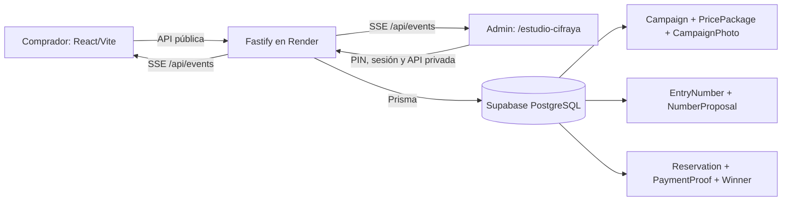
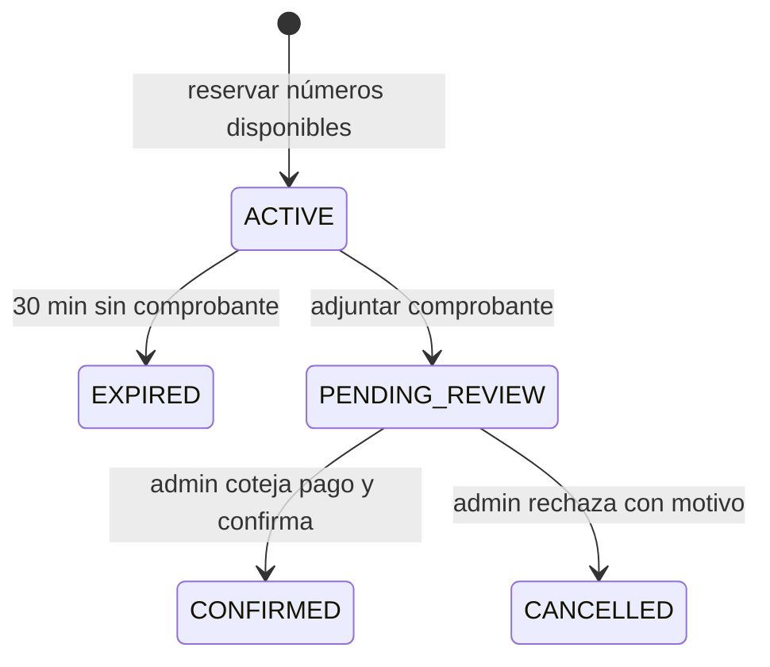

# Cifraya — mapa compacto del proyecto

Leer este archivo primero en futuras sesiones. Para una relación concreta entre archivos o funciones, consultar [`graphify-out/graph.json`](../graphify-out/graph.json) o ejecutar `graphify query "pregunta" --budget 800`. El [grafo interactivo](../graphify-out/graph.html) permite explorar visualmente el código. El grafo automático cubre código; este mapa añade reglas de negocio y decisiones.

## Rutas y archivos

| Nodo | Responsabilidad | Fuente |
|---|---|---|
| Web pública | Inicio `/`, `/buscar-boletos`, `/ganadores`, `/rifa/:slug`; selección, reserva, comprobantes, podio y footer social | `apps/web/src/App.tsx`, `apps/web/src/WinnersPodium.tsx`, `apps/web/src/FooterSocials.tsx` |
| Centro de control | `/estudio-cifraya`; creación y edición de rifas, boletos tipo tarjeta, ganador e historial | `apps/web/src/App.tsx`, `EditRaffle.tsx`, `AdminRaffleDetail.tsx` |
| Participantes y pagos | Ficha privada por correo; revisión manual de comprobantes | `AdminParticipantDetail.tsx`, `AdminReservationReview.tsx` |
| API | Rutas, validación, autenticación, reservas atómicas y SSE | `apps/api/src/server.ts` |
| Vencimientos | Liberación transaccional de apartados y coordinación de consultas simultáneas | `apps/api/src/reservationExpiry.ts` |
| Seguridad HTTP | Cabeceras CSP, bloqueo de marcos y caché privada | `apps/api/src/security.ts` |
| Datos | Modelos e índices; migraciones aplicadas al arrancar Render | `prisma/schema.prisma`, `prisma/migrations/` |
| Despliegue | Una web/API Node en Render; PostgreSQL externo en Supabase | `render.yaml` |

## Flujo de boletos

- Rifas admiten **100, 1.000 o 10.000 números** (`00–99`, `000–999`, `0000–9999`). La compra se hace escogiendo un paquete; el servidor asigna esa cantidad de números disponibles al azar y permite cinco regeneraciones del conjunto completo. El precio de la reserva es el precio exacto del paquete. Sin paquetes configurados, se ofrece un boleto individual como compatibilidad.
- Cada rifa configura de uno a tres premios por posición. `Campaign.prize` es el primer premio para conservar rifas anteriores; `secondPrize` y `thirdPrize` se usan según `prizeCount`. Los ganadores se publican en orden, con números vendidos distintos; la rifa se cierra al publicar el último. La migración asigna primer puesto a ganadores anteriores.
- Edición: un borrador permite cambiar URL, precio, cantidad de números, paquetes y premios; al cambiar la cantidad se reconstruye el inventario dentro de una transacción, siempre sin reservas. Una rifa publicada o cerrada solo permite corregir título y descripción; fotos se administran por separado.
- La propuesta aleatoria no aparta números. La reserva sí los reclama en transacción serializable; un conflicto debe devolver 409. Un comprobante presentado a tiempo conserva el apartado durante la revisión. Solo `CONFIRMED` puede resultar ganador.
- Fotos del premio: hasta cinco; comprobantes: hasta tres. Cada imagen guardada pesa como máximo 2 MB. **Ambos tipos se guardan hoy en PostgreSQL**, no en Supabase Storage. El administrador debe cotejar SINPE con el dinero realmente recibido; la foto sola no verifica el pago.
- La ficha mini CRM relaciona reservas por correo electrónico sin distinguir mayúsculas, con historial paginado. Es una agrupación práctica, no una identidad verificada.
- Los cambios se propagan por SSE y las vistas activas consultan de respaldo cada 20 segundos. El servicio gratuito de Render puede dormir; SSE no equivale a disponibilidad garantizada 24/7.
- La API limita a 200 conexiones SSE simultáneas por proceso y comparte una sola ejecución de vencimiento cuando coinciden solicitudes. Las cargas de fotos se serializan para respetar el máximo de cinco incluso con peticiones concurrentes.
- El PIN admin crea una sesión HMAC de ocho horas firmada con `ADMIN_TOKEN` (`apps/api/src/adminSession.ts`); sobrevive reinicios del proceso. Si vence, el formulario de borrador permanece en estado de la pestaña mientras se vuelve a ingresar el PIN.

## Reglas de trabajo

- Mantener el diseño general blanco y negro, con los colores originales de WhatsApp, Facebook e Instagram solo en el footer; las preguntas van dentro de la interfaz. Evitar texto de “prueba” en el producto público.
- El footer muestra WhatsApp, Facebook e Instagram con relleno y tooltip de marca. Sin URL configurada, cada icono queda visible pero inactivo; las URL públicas se añaden como `VITE_CIFRAYA_*_URL` al compilar la web.
- Inicio muestra paquetes de la rifa principal directamente; elegir uno abre `/rifa/:slug` y solicita sus números. El indicador de diez barras aparece al cargar desde Inicio y al generar o cambiar el conjunto completo en la rifa.
- No publicar credenciales, PIN, comprobantes ni datos personales en este grafo. Las rutas admin requieren sesión; los comprobantes solo se sirven con autorización.
- Verificar con `pnpm db:generate`, `pnpm build` y `git diff --check` cuando cambien esquema o código. Para actualizar el grafo automático tras cambios de código: `graphify extract . --code-only` y `graphify cluster-only . --no-label`.
